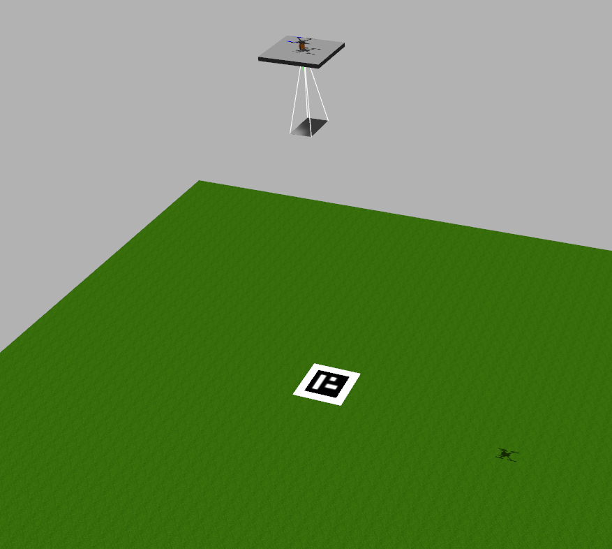

# Gazebo-ROS Overloaded Quadcopter
Code created within the scope of the thesis entitled "Controlled of an Overloaded Quadcopter Using Vision", by João Pinhal.

ROS Packages used to test viability of control of an overloaded quadcopter.

**Tested with PX4 Autopilot 1.13.0 - ROS Melodic - Gazebo Classic 9 - Ubuntu 18.04**

## How to setup the software

1. Install PX4-Autopilot with ROS/Gazebo (see https://docs.px4.io/main/en/dev_setup/dev_env_linux_ubuntu.html)

2. Install QGroundControl (see https://docs.qgroundcontrol.com/master/en/getting_started/download_and_install.html)

3. Copy ROS packages in `/ros_pkgs` to new `catkin_ws/src` directory

4. Replace original PX4 launch files present in `PX4-Autopilot/launch` directory for the ones inside `/px4_launch_files`

5. Build ROS packages

6. At the end of `~/.bashrc` file introduce these lines:

```
source ~/PX4-Autopilot/Tools/setup_gazebo.bash ~/PX4-Autopilot ~/PX4-Autopilot/build/px4_sitl_default
export ROS_PACKAGE_PATH=$ROS_PACKAGE_PATH:~/PX4-Autopilot
export ROS_PACKAGE_PATH=$ROS_PACKAGE_PATH:~/PX4-Autopilot/Tools/sitl_gazebo
export GAZEBO_PLUGIN_PATH=$GAZEBO_PLUGIN_PATH:/usr/lib/x86_64-linux-gnu/gazebo-9/plugins
```

7. Open QGroundControl and set these parameters:
   
```
COM_RCL_EXCEPT -> 4
MPC_MAN_TILT_MAX -> 30.0 deg
MPC_TILTMAX_AIR -> 30.0 deg
MC_ROLL_P -> 3.25
MC_PITCH_P -> 3.25
```

## How to run the software

To run the main test program run the following command in the terminal:
```
roslaunch main_pkg start_main.launch
```



There are multiple parameters that can be found on the launch files, as for example the log and drop functionalities. An example on how to change these parameters when running the software is inputting the following command on the terminal:
```
roslaunch main_pkg start_main.launch log:=1 drop:=1
```

The main test parameters are represented in the following pictures:

<p float="center">


</p>

## ROS Packages

### **main_pkg**

Package built for this application that contains the ArUco Tracker algorithm and main control algorithm. Also contains models used and Gazebo world.

### **custom_plugins_pkg**

Package that contains a mass controller plugin adapted from (https://bitbucket.org/theconstructcore/buoyancy_tests_pkg/src/master/buoyancy_tests_pkg/) that allows the control of the mass of the payload and even to simulate the gradual loss of mass (by for example a liquid disposal instead of a solid mass), although this functionality ended up not being used.

### **gazebo_ros_link_attacher_plugin**

Package created by PAL Robotics (https://github.com/pal-robotics/gazebo_ros_link_attacher) that allows to control the detachment of the load using ROS messages.
